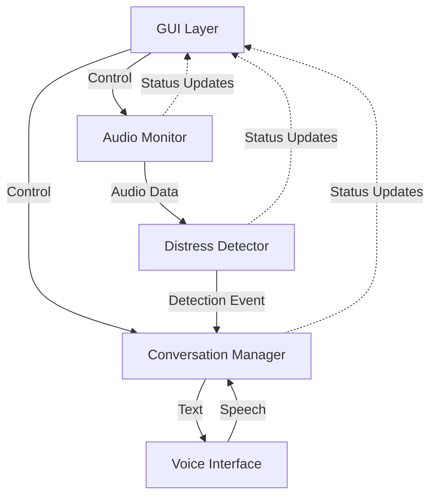
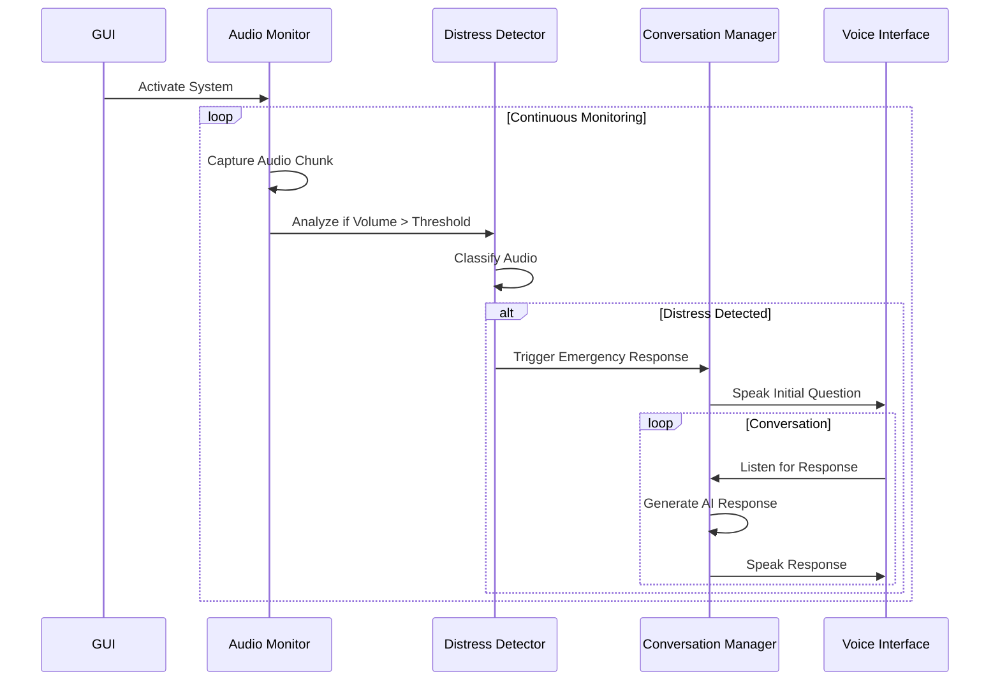

# Design Document: Emergency Care Health Observer (E.C.H.O.)

## Overview

The E.C.H.O. system is architected as a multi-threaded Python application with clear separation between audio processing, AI inference, user interface, and conversation management. The system uses a pipeline architecture where audio flows through monitoring → detection → classification → response stages. The design emphasizes non-blocking operation, graceful error handling, and real-time responsiveness.

### Key Design Principles

1. **Separation of Concerns**: Audio capture, classification, conversation, and UI are independent components
2. **Thread Safety**: Background processing threads communicate with GUI through thread-safe mechanisms
3. **Graceful Degradation**: Network or API failures don't crash the system
4. **Real-Time Responsiveness**: UI remains responsive during heavy audio processing
5. **Privacy by Design**: Microphone can be disabled at any time

## Architecture

### High-Level Architecture



### Component Interaction Flow



## Components and Interfaces

### 1. Audio Monitor Component

**Responsibility**: Capture and preprocess audio input in real-time.

**Interface**:
```python
class AudioMonitor:
    def __init__(self, sample_rate: int, chunk_size: int, volume_threshold: float)
    def start_monitoring(self, callback: Callable[[np.ndarray, float], None]) -> None
    def stop_monitoring(self) -> None
    def pause_capture(self) -> None
    def resume_capture(self) -> None
    def is_monitoring(self) -> bool
```

**Key Methods**:
- `start_monitoring()`: Initializes PyAudio stream and begins continuous capture loop
- `stop_monitoring()`: Cleanly closes audio stream and terminates thread
- `pause_capture()`: Temporarily stops reading from microphone (privacy mode)
- `resume_capture()`: Resumes reading from microphone

**Implementation Details**:
- Uses PyAudio with float32 format for direct amplitude analysis
- Operates in separate thread to avoid blocking GUI
- Calculates volume as maximum absolute amplitude of chunk
- Invokes callback only when volume exceeds threshold
- Handles overflow exceptions gracefully

### 2. Distress Detector Component

**Responsibility**: Classify audio and identify distress signals using ML model.

**Interface**:
```python
class DistressDetector:
    def __init__(self, model_name: str, confidence_threshold: float)
    def load_model(self) -> bool
    def classify_audio(self, audio_data: np.ndarray) -> ClassificationResult
    def is_distress(self, result: ClassificationResult, volume: float) -> bool
    def get_distress_labels(self) -> List[str]

class ClassificationResult:
    label: str
    confidence: float
    all_scores: Dict[str, float]
```

**Key Methods**:
- `load_model()`: Loads CLAP model from HuggingFace, returns success status
- `classify_audio()`: Performs zero-shot classification on audio array
- `is_distress()`: Determines if classification indicates distress based on label, confidence, and volume

**Implementation Details**:
- Uses HuggingFace Transformers pipeline with "laion/clap-htsat-unfused" model
- Runs on CPU (device=-1) for compatibility
- Candidate labels include 4 distress categories and 6 normal sound categories
- Distress detection requires: (confidence > threshold AND label in distress_labels) OR volume > 0.6
- Model loading happens asynchronously at startup

### 3. Conversation Manager Component

**Responsibility**: Manage AI-driven conversations with users during emergencies.

**Interface**:
```python
class ConversationManager:
    def __init__(self, model_name: str, voice_interface: VoiceInterface)
    def start_conversation(self, distress_type: str, audio_stream: Any) -> None
    def is_in_conversation(self) -> bool
    def stop_conversation(self) -> None
    def should_terminate(self, user_text: str) -> bool

class ChatMessage:
    role: str  # 'system', 'user', 'assistant'
    content: str
```

**Key Methods**:
- `start_conversation()`: Initiates emergency conversation with context about detected distress
- `is_in_conversation()`: Returns whether conversation is currently active
- `stop_conversation()`: Gracefully terminates conversation
- `should_terminate()`: Checks if user input contains termination phrases

**Implementation Details**:
- Uses Ollama with qwen2.5:3b model for response generation
- Maintains chat history as list of ChatMessage objects
- System prompt: "You are E.C.H.O. emergency AI. Keep responses short."
- Initial context includes detected distress type
- Conversation loop: listen → transcribe → generate response → speak → repeat
- Termination phrases: "satisfied", "i am good", "care is complete", "stop", "deactivate"
- Respects microphone disable and system deactivation signals

### 4. Voice Interface Component

**Responsibility**: Handle text-to-speech synthesis and speech recognition.

**Interface**:
```python
class VoiceInterface:
    def __init__(self, voice_name: str, sample_rate: int)
    def speak(self, text: str, log_callback: Callable[[str, str], None]) -> None
    def listen(self, audio_stream: Any, duration: int) -> str
    def set_recognizer_sensitivity(self, amplification: float) -> None
```

**Key Methods**:
- `speak()`: Converts text to speech and plays audio
- `listen()`: Captures audio from stream and converts to text
- `set_recognizer_sensitivity()`: Adjusts audio amplification for better recognition

**Implementation Details**:
- Text-to-Speech: Uses edge-tts with en-US-EricNeural voice
- Speech Recognition: Uses Google Speech Recognition API via speech_recognition library
- Audio playback: Uses pygame mixer for non-blocking playback
- Audio amplification: Multiplies captured audio by 1.5x before recognition
- Temporary file management: Creates echo_voice.mp3, deletes after playback
- Error handling: Logs errors but continues operation on failure
- Listen duration: Configurable, defaults to 5 seconds

### 5. GUI Component

**Responsibility**: Provide user interface for system control, status display, and logging.

**Interface**:
```python
class EchoGUI:
    def __init__(self, root: tk.Tk)
    def set_status(self, main_text: str, sub_text: str, color: str) -> None
    def log(self, text: str, category: str) -> None
    def open_log_window(self) -> None
    def on_activate_clicked(self) -> None
    def on_mic_toggle_clicked(self) -> None
    def on_show_logs_clicked(self) -> None
```

**Key Methods**:
- `set_status()`: Updates main status display with text and color
- `log()`: Adds entry to log history and updates log window if open
- `open_log_window()`: Creates or focuses separate log window
- `on_activate_clicked()`: Handles system activation/deactivation
- `on_mic_toggle_clicked()`: Handles microphone enable/disable

**Implementation Details**:
- Built with Tkinter for cross-platform compatibility
- Main window: 800x600 pixels, dark theme (#050510 background)
- Status display: Large centered text with color-coded states
  - Green (#00ff00): MONITORING
  - Yellow (#ffff00): ANALYZING
  - Red (#ff0000): DISTRESS DETECTED
  - Cyan (#00ccff): LISTENING
  - Magenta (#ff00ff): THINKING
  - Gray (#555555): STANDBY/INITIALIZING
- Log window: Separate Toplevel window with ScrolledText widget
- Log categories: system (cyan), alert (red), ai (white), user (gray)
- Background: Optional image with grid overlay fallback
- Thread-safe updates: Uses root.after() for GUI updates from background threads

## Data Models

### Audio Data Flow

```python
# Raw audio from PyAudio
AudioChunk = np.ndarray  # shape: (chunk_size,), dtype: float32, range: [-1.0, 1.0]

# Volume calculation
Volume = float  # range: [0.0, 1.0], calculated as max(abs(AudioChunk))

# Classification input/output
ClassificationInput = np.ndarray  # float32 audio array
ClassificationOutput = {
    'label': str,           # Top classification label
    'score': float,         # Confidence score [0.0, 1.0]
    'all_scores': List[Dict[str, float]]  # All label scores
}
```

### Conversation State

```python
# Chat history structure
ChatHistory = List[ChatMessage]

ChatMessage = {
    'role': str,      # 'system' | 'user' | 'assistant'
    'content': str    # Message text
}

# Conversation state
ConversationState = {
    'active': bool,
    'distress_type': str,
    'history': ChatHistory,
    'should_stop': bool
}
```

### System State

```python
# Application state
SystemState = {
    'monitoring_active': bool,
    'microphone_enabled': bool,
    'model_loaded': bool,
    'in_conversation': bool,
    'current_status': str,  # 'INITIALIZING' | 'STANDBY' | 'MONITORING' | etc.
    'stop_event': threading.Event
}

# Log entry
LogEntry = {
    'text': str,
    'category': str,  # 'system' | 'alert' | 'ai' | 'user'
    'timestamp': float
}
```

### Configuration

```python
# System configuration
Config = {
    'audio': {
        'sample_rate': int,      # 48000 Hz
        'chunk_size': int,       # 48000 samples (1 second)
        'volume_threshold': float,  # 0.03
        'amplification': float   # 1.5
    },
    'detection': {
        'model_name': str,       # 'laion/clap-htsat-unfused'
        'confidence_threshold': float,  # 0.50
        'high_volume_threshold': float,  # 0.6
        'candidate_labels': List[str],
        'distress_labels': List[str]
    },
    'conversation': {
        'model_name': str,       # 'qwen2.5:3b'
        'listen_duration': int,  # 5 seconds
        'termination_phrases': List[str]
    },
    'voice': {
        'tts_voice': str,        # 'en-US-EricNeural'
        'temp_file': str         # 'echo_voice.mp3'
    },
    'gui': {
        'window_size': Tuple[int, int],  # (800, 600)
        'theme': Dict[str, str],  # Color mappings
        'status_colors': Dict[str, str]
    }
}
```


## Correctness Properties

*A property is a characteristic or behavior that should hold true across all valid executions of a system—essentially, a formal statement about what the system should do. Properties serve as the bridge between human-readable specifications and machine-verifiable correctness guarantees.*

### Audio Monitoring Properties

**Property 1: Volume threshold triggers classification**
*For any* audio chunk captured by the Audio_Monitor, if the maximum absolute amplitude exceeds the Volume_Threshold, then the Distress_Detector classification method should be invoked.
**Validates: Requirements 1.4**

**Property 2: Microphone state controls audio capture**
*For any* microphone state transition (enabled ↔ disabled), the Audio_Monitor should immediately reflect the new state by either capturing or not capturing audio data.
**Validates: Requirements 1.3, 6.2, 6.3**

### Distress Detection Properties

**Property 3: High confidence distress triggers emergency response**
*For any* classification result where the label is in the distress category and confidence exceeds the Confidence_Threshold, the emergency response protocol should be triggered.
**Validates: Requirements 2.3**

**Property 4: High volume triggers emergency response**
*For any* audio chunk with volume exceeding 0.6, the emergency response protocol should be triggered regardless of classification result.
**Validates: Requirements 2.4**

**Property 5: Non-distress classification continues monitoring**
*For any* classification result where the label is not in the distress category or confidence is below the Confidence_Threshold, no emergency response should be triggered and monitoring should continue.
**Validates: Requirements 2.5**

**Property 6: Classification returns structured result**
*For any* audio classification, the result should contain a label (string) and confidence score (float between 0.0 and 1.0).
**Validates: Requirements 2.6**

### Conversation Management Properties

**Property 7: Initial message includes distress type**
*For any* conversation initiation triggered by distress detection, the initial message spoken to the user should contain a reference to the detected distress type.
**Validates: Requirements 3.2**

**Property 8: Chat history accumulates messages**
*For any* conversation, adding a new message (user or assistant) should increase the length of the chat history by exactly one.
**Validates: Requirements 3.3, 4.2**

**Property 9: Termination phrases end conversation**
*For any* user input containing one of the termination phrases ("satisfied", "i am good", "care is complete", "stop", "deactivate"), the should_terminate method should return true and the conversation should end.
**Validates: Requirements 3.4, 4.6**

**Property 10: Speech recognition failures don't crash system**
*For any* speech recognition failure (network error or unrecognized audio), the Conversation_Manager should log the error and continue the conversation loop without raising an exception.
**Validates: Requirements 4.5**

### Voice Interface Properties

**Property 11: Temporary files cleaned after speech**
*For any* text-to-speech operation, after the audio playback completes, the temporary audio file should be deleted from the filesystem.
**Validates: Requirements 5.4**

**Property 12: Audio amplification is consistent**
*For any* captured audio array, the amplified version used for speech recognition should have all values multiplied by exactly 1.5.
**Validates: Requirements 5.7**

**Property 13: Network errors don't crash voice interface**
*For any* network error during speech recognition, the Voice_Interface should log the error and return control to the caller without raising an exception.
**Validates: Requirements 5.6**

### GUI Properties

**Property 14: Microphone state reflected in display**
*For any* microphone state (enabled or disabled), the GUI button text should accurately reflect the current state ("MIC: ON" or "MIC: OFF").
**Validates: Requirements 6.4**

**Property 15: Status display shows valid states**
*For any* system state change, the GUI status display should show one of the valid states: INITIALIZING, STANDBY, MONITORING, ANALYZING, DISTRESS DETECTED, LISTENING, or THINKING.
**Validates: Requirements 7.1**

**Property 16: Status has subtitle context**
*For any* system state displayed in the GUI, there should be an accompanying subtitle providing additional context.
**Validates: Requirements 7.6**

**Property 17: Log entries are categorized**
*For any* log entry added to the system, it should have a category that is one of: system, alert, ai, or user.
**Validates: Requirements 8.2**

**Property 18: Log category determines color**
*For any* log entry displayed in the log window, the text color should match the category: cyan for system, red for alert, white for ai, gray for user.
**Validates: Requirements 8.4**

**Property 19: Logs accumulate throughout session**
*For any* log entry added during a session, it should be appended to the log history, increasing the history length by exactly one.
**Validates: Requirements 8.1, 8.5**

**Property 20: Log window auto-scrolls to latest**
*For any* new log entry added while the log window is open, the scroll position should update to show the latest entry at the bottom.
**Validates: Requirements 8.6**

**Property 21: Activation button reflects system state**
*For any* system state (active or inactive), the activation button text should reflect the current state: "DEACTIVATE" when active, "ACTIVATE SYSTEM" when inactive.
**Validates: Requirements 9.2, 9.3**

**Property 22: Button color indicates active state**
*For any* system state, the activation button color should be red when active and green when inactive.
**Validates: Requirements 9.5**

### Error Handling Properties

**Property 23: Model loading failure sets error state**
*For any* model loading failure, the system status should be set to "ERROR" and the failure should be logged.
**Validates: Requirements 10.4**

**Property 24: Component errors are logged and handled gracefully**
*For any* error in audio capture, speech recognition, voice synthesis, LLM generation, or file cleanup, the error should be logged and the system should continue operation without crashing.
**Validates: Requirements 11.1, 11.2, 11.3, 11.4, 11.5, 11.6**

### Threading Properties

**Property 25: System stops within timeout**
*For any* deactivation request, the Audio_Monitor thread should stop processing and terminate within 1 second.
**Validates: Requirements 12.3**

## Error Handling

### Error Categories and Responses

1. **Audio Capture Errors**
   - Cause: Microphone unavailable, permission denied, hardware failure
   - Response: Log error, display error status, prevent system activation
   - Recovery: User must resolve hardware/permission issue and restart

2. **Model Loading Errors**
   - Cause: Network failure, insufficient memory, missing dependencies
   - Response: Log error, display "ERROR" status, prevent activation
   - Recovery: User must resolve dependency/network issue and restart

3. **Speech Recognition Errors**
   - Cause: Network failure (Google API), unrecognized audio, background noise
   - Response: Log error or placeholder, continue conversation loop
   - Recovery: Automatic - system continues listening

4. **Voice Synthesis Errors**
   - Cause: Network failure (edge-tts), file system errors
   - Response: Log error, skip speech output, continue operation
   - Recovery: Automatic - system continues with next operation

5. **LLM Generation Errors**
   - Cause: Ollama service unavailable, model not found, timeout
   - Response: Log error, continue conversation loop
   - Recovery: Automatic - system continues listening

6. **File System Errors**
   - Cause: Permission denied, disk full, file locked
   - Response: Log error, ignore cleanup failure, continue operation
   - Recovery: Automatic - temporary files may accumulate

### Error Handling Patterns

```python
# Pattern 1: Critical errors that prevent operation
try:
    audio_stream = initialize_audio()
except AudioError as e:
    log_error(e)
    set_status("ERROR")
    disable_activation()
    return

# Pattern 2: Non-critical errors that allow continuation
try:
    text = recognize_speech(audio)
except NetworkError as e:
    log_error(e)
    text = ""  # Use empty string and continue
except UnknownValueError:
    log_placeholder("...")
    text = ""  # Use empty string and continue

# Pattern 3: Cleanup errors that can be ignored
try:
    os.remove(temp_file)
except OSError:
    pass  # Ignore cleanup failures
```

### Logging Strategy

All errors should be logged with:
- Error type/category
- Error message
- Timestamp
- Current system state
- Component that generated the error

Log format: `[ERROR] {Component}: {Message}`

## Testing Strategy

### Dual Testing Approach

The E.C.H.O. system requires both unit tests and property-based tests for comprehensive coverage:

- **Unit tests**: Verify specific examples, edge cases, and error conditions
- **Property tests**: Verify universal properties across all inputs

Together, these approaches provide comprehensive coverage where unit tests catch concrete bugs and property tests verify general correctness.

### Property-Based Testing

We will use **Hypothesis** (Python's property-based testing library) to implement the correctness properties defined above.

**Configuration**:
- Minimum 100 iterations per property test
- Each test must reference its design document property
- Tag format: `# Feature: emergency-care-health-observer, Property {number}: {property_text}`

**Example Property Test Structure**:
```python
from hypothesis import given, strategies as st
import numpy as np

# Feature: emergency-care-health-observer, Property 1: Volume threshold triggers classification
@given(st.floats(min_value=0.0, max_value=1.0))
def test_volume_threshold_triggers_classification(volume):
    # Generate audio chunk with specific volume
    audio_chunk = generate_audio_with_volume(volume)
    
    # Track if classification was called
    classification_called = False
    
    def mock_classify(audio):
        nonlocal classification_called
        classification_called = True
    
    monitor = AudioMonitor(volume_threshold=0.03)
    monitor.set_classifier(mock_classify)
    monitor.process_chunk(audio_chunk)
    
    # Property: volume > threshold implies classification called
    if volume > 0.03:
        assert classification_called
    else:
        assert not classification_called
```

### Unit Testing Focus Areas

Unit tests should focus on:

1. **Specific Examples**
   - Sample rate configuration (48kHz)
   - Chunk size configuration (48000 samples)
   - Specific termination phrases recognized
   - Specific color mappings for states

2. **Edge Cases**
   - System deactivation during conversation
   - Microphone disabled during conversation
   - Early activation before model loads
   - Empty audio chunks
   - Maximum volume (1.0) audio

3. **Integration Points**
   - Audio Monitor → Distress Detector flow
   - Distress Detector → Conversation Manager flow
   - Conversation Manager → Voice Interface flow
   - Background threads → GUI updates

4. **Error Conditions**
   - Audio capture initialization failure
   - Model loading failure
   - Network failures in speech recognition
   - Network failures in TTS
   - Ollama service unavailable
   - File deletion failures

### Test Data Generation

For property-based tests, we need generators for:

```python
# Audio data generators
@st.composite
def audio_chunk(draw, sample_rate=48000):
    """Generate random audio chunk with controlled volume."""
    volume = draw(st.floats(min_value=0.0, max_value=1.0))
    samples = draw(st.lists(
        st.floats(min_value=-volume, max_value=volume),
        min_size=sample_rate,
        max_size=sample_rate
    ))
    return np.array(samples, dtype=np.float32)

# Classification result generators
@st.composite
def classification_result(draw):
    """Generate random classification result."""
    labels = ["screaming in pain", "crying in agony", "talking", "silence"]
    label = draw(st.sampled_from(labels))
    confidence = draw(st.floats(min_value=0.0, max_value=1.0))
    return ClassificationResult(label=label, confidence=confidence)

# Chat message generators
@st.composite
def chat_message(draw):
    """Generate random chat message."""
    role = draw(st.sampled_from(['system', 'user', 'assistant']))
    content = draw(st.text(min_size=1, max_size=200))
    return ChatMessage(role=role, content=content)

# User input generators
@st.composite
def user_input(draw, include_termination=False):
    """Generate random user input, optionally including termination phrases."""
    if include_termination and draw(st.booleans()):
        return draw(st.sampled_from([
            "satisfied", "i am good", "care is complete", "stop", "deactivate"
        ]))
    return draw(st.text(min_size=1, max_size=100))
```

### Mocking Strategy

For testing components in isolation:

1. **Mock PyAudio**: Use in-memory audio streams for testing
2. **Mock CLAP Model**: Return controlled classification results
3. **Mock Ollama**: Return predefined responses without network calls
4. **Mock edge-tts**: Skip actual TTS generation, verify calls
5. **Mock speech_recognition**: Return controlled transcription results
6. **Mock pygame mixer**: Verify audio playback calls without actual playback

### Test Organization

```
tests/
├── unit/
│   ├── test_audio_monitor.py
│   ├── test_distress_detector.py
│   ├── test_conversation_manager.py
│   ├── test_voice_interface.py
│   └── test_gui.py
├── property/
│   ├── test_audio_properties.py
│   ├── test_detection_properties.py
│   ├── test_conversation_properties.py
│   ├── test_voice_properties.py
│   ├── test_gui_properties.py
│   └── test_error_handling_properties.py
├── integration/
│   ├── test_end_to_end_flow.py
│   └── test_threading.py
└── conftest.py  # Shared fixtures and generators
```

### Coverage Goals

- Unit test coverage: >80% of code lines
- Property test coverage: 100% of correctness properties
- Integration test coverage: All major component interactions
- Error path coverage: All error handling branches

### Continuous Testing

Tests should be run:
- Before each commit (pre-commit hook)
- On pull requests (CI/CD)
- Nightly with extended property test iterations (1000+)
